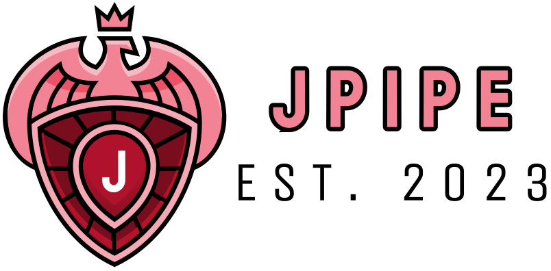

# jPipe - Justified Pipelines

<div align="center">

  

</div>


<div align="center">

[](https://github.com/ace-design/jpipe/actions/workflows/compiler.yml) &nbsp; &nbsp; &nbsp; 
[](https://github.com/ace-design/jpipe/actions/workflows/extension.yml)
</div>


The jPipe environment supports the definition of justification to support software maintenance activities. The name comes from "justified pipelines", as the key idea is to design an environment supporting the justification of CI/CD pipelines by design.

## General Information

<div align="center">


</div>

- Version: 24.07
- Architect and main developer:
  - [Sébastien Mosser](https://mosser.github.io/), McSCert, McMaster University.
- Main Contributors:
  - [Cass Braun](https://www.linkedin.com/in/cass-braun/), McSCert, McMaster University. Developer.
  - [Nirmal Chaudhari](https://www.linkedin.com/in/nirmal2003/), McSCert, McMaster University. Developer.
  - [Aaron Loh](https://www.linkedin.com/in/aaron-loh26/), McSCert, McMaster University. Developer.
  - [Deesha Patel](https://www.linkedin.com/in/deeshupatel/), McSCert, McMaster University. Developer.
  - [Corinne Pulgar](https://www.linkedin.com/in/corinne-pulgar-12a58190/), École de Technologie Supérieure (ETS). Developer
- Advisors:
  - [Jean-Michel Bruel](https://jmbruel.netlify.app/), Université de Toulouse. Language design.
  - [Mireille Blay-Fornarino](https://mireilleblayfornarino.i3s.unice.fr/), Université Côte d'Azur. Composition mechanisms.

## Repository organization

  - `ab-compiler`: source code of the (action-based) compiler
  - `brew`: distribution of the code using HomeBrew
  - `langium`: source code of the Visual Code extension IDE

## Documentation

We're using GitHub wiki system to document jPipe: [https://github.com/ace-design/jpipe/wiki](https://github.com/ace-design/jpipe/wiki).

## How to cite?

```bibtex
@software{mcscert:jpipe,
  author = {Mosser, Sébastien},
  license = {MIT},
  title = {{jPipe Language}},
  url = {https://github.com/ace-design/jpipe}
}
```

## How to contribute?

Found a bug, or want to add a cool feature? Feel free to fork this repository and send a pull request. 

If you're interested in contributing to the research effort related to jPipe, feel free to contact the PI: [Dr. Sébastien Mosser](mossers@mcmaster.ca). 

**We do have undergrad summer internships available to contribute to the compiler, as 
well as MASc and PhD positions in Software Engineering at Mac.**

## Sponsors


We acknowledge the support of the _Natural Sciences and Engineering Research Council of Canada_ 
(NSERC), as well as McMaster _Excellence in Research Award_ (EREA) from the Faculty of Engineering.

<div align="center">

  

</div>
