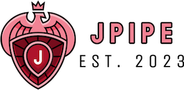
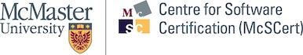

# jPipe - Justified Pipelines

The jPipe environment supports the definition of justification to support software maintenance activities. The name comes from "justified pipelines", as the key idea is to design an environment supporting the justification of CI/CD pipelines by design.

## General Information
- Version: 24.02
- Architect and main developer:
  - Sébastien Mosser, McSCert, McMaster University.
- Main Contributors:
  - Cass Braun, McSCert, McMaster University. Developer.
  - Nirmal Chaudhari, McSCert, McMaster University. Developer.
  - Aaron Loh, McSCert, McMaster University. Developer.
  - Deesha Patel, McSCert, McMaster University. Developer.
  - Corinne Pulgar, École de Technologie Supérieure. Developer
- Advisors:
  - Jean-Michel Bruel, Université de Toulouse. Language design.
  - Mireille Blay Fornarino, Université Côte d'Azur. Composition mechanisms.

## Repository organization

  - `compiler`: source code of the compiler
  - `lsp`: source code of the language-server
  - `vs-extension`: source code of the Visual Code extension

## License

This software is provided as is under the MIT license.

## How to contribute?

Found a bug, or want to add a cool feature? Feel free to fork this repository and send a pull request. 

If you're interested in contributing to the research effort related to jPipe, feel free to contact the PI: [Dr. Sébastien Mosser](mossers@mcmaster.ca). We do have undergrad summer internships available to contribute to the compiler, as well as MASc and PhD positions in Software Engineering at Mac.

## Sponsors

We acknowledge the support of the Natural Sciences and Engineering Research Council of Canada (NSERC).

 

